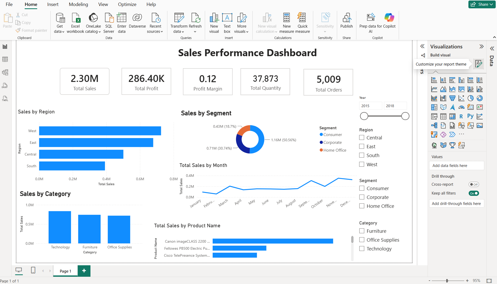

# 📊 Sales Performance Dashboard

An interactive **Sales Performance Dashboard** built using **Microsoft Power BI** and the **Superstore dataset**.

## 📌 Project Overview

This dashboard provides a clear view of sales performance and helps analyze business performance across different regions, segments, categories, months, and products.

## 🛠️ Tools & Technologies

- Microsoft Power BI
- DAX
- Power Query
- Data Visualization
- Superstore Dataset

## 📊 Dashboard KPIs

- Total Sales: 2.30M
- Total Profit: 286.40K
- Profit Margin: 0.12
- Total Quantity: 37,873
- Total Orders: 5,009

## 📈 Dashboard Features

- Sales by Region
- Sales by Segment
- Sales by Category
- Monthly Sales Trend
- Sales by Product
- Year-wise filtering
- Region, Segment and Category slicers
- Interactive KPI cards

## 🖼️ Dashboard Preview

## 🎯 Objective

The objective of this project is to analyze sales data and create an interactive dashboard that provides meaningful insights into sales, profit, quantity, orders, and business performance.

## 📂 Project Files

- `dashboard.png` — Dashboard preview
- `README.md` — Project documentation

## 👨‍💻 Author

**Aniket Patil**

B.Tech CSE – Artificial Intelligence & Machine Learning
